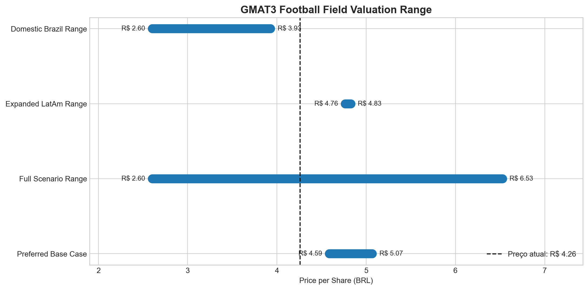

# Relatório Final — Valuation por Múltiplos da GMAT3

## 1. Objetivo do Projeto

Este projeto tem como objetivo estimar uma faixa de valor justo para a ação da Grupo Mateus (`GMAT3.SA`) usando a metodologia de valuation relativo, também chamada de trading comparables ou valuation por múltiplos.

Em vez de projetar fluxos de caixa por muitos anos, como em um DCF, a metodologia compara a empresa-alvo com empresas parecidas que já são negociadas em bolsa.

Em termos simples:

> Se empresas parecidas negociam a determinado múltiplo, podemos usar esse múltiplo como referência para estimar quanto a GMAT3 poderia valer.

## 2. Empresa-Alvo

A empresa-alvo do projeto é:

| Item | Informação |
|---|---|
| Empresa | Grupo Mateus |
| Ticker | GMAT3.SA |
| Setor | Varejo alimentar / atacarejo |
| Mercado | Brasil |
| Método principal | EV/EBITDA |

A análise busca entender se o preço atual da GMAT3 está baixo, justo ou alto em relação a empresas comparáveis.

---

## 3. Estrutura do Projeto

O projeto foi organizado em três notebooks principais.

### Notebook 01 — Data Validation and Market Data

Arquivo:

`notebooks/01-data-validation.ipynb`

Objetivo:

- carregar os dados financeiros brutos;
- validar tipos de dados;
- verificar valores ausentes;
- buscar preço de mercado e market cap;
- calcular dívida líquida;
- calcular enterprise value;
- calcular EV/EBITDA inicial;
- exportar a base processada.

Saída principal:

`data/processed/master_valuation_dataset.csv`

### Notebook 02 — Expanded Relative Valuation

Arquivo:

`notebooks/02-relative-valuation.ipynb`

Objetivo:

- separar GMAT3 como empresa-alvo;
- montar o peer group expandido;
- diferenciar peers saudáveis, distressed e referências operacionais;
- calcular estatísticas de múltiplos;
- construir cenários de valuation;
- fazer a ponte de Enterprise Value para Equity Value;
- calcular preço justo por ação;
- exportar os outputs do valuation.

Saídas principais:

- `outputs/gmat3_relative_valuation_scenarios.csv`
- `outputs/current_market_positioning.csv`
- `outputs/expanded_peer_multiples.csv`
- `outputs/expanded_peer_stats.csv`

### Notebook 03 — Valuation Charts

Arquivo:

`notebooks/03-valuation-charts.ipynb`

Objetivo:

- transformar os outputs do valuation em gráficos;
- gerar visuais para relatório e slide executivo;
- explicar os gráficos em português e inglês;
- salvar as imagens na pasta `charts/`.

Saídas principais:

- `charts/ev_ebitda_peer_comparison.png`
- `charts/scenario_multiples.png`
- `charts/fair_price_by_scenario.png`
- `charts/upside_downside_by_scenario.png`
- `charts/football_field_chart.png`

---

## 4. Dados Utilizados

A base inicial contém dados de:

- GMAT3;
- Assaí;
- GPA.

Esses dados incluem:

- receita;
- EBITDA;
- EBIT;
- lucro líquido;
- caixa;
- dívida total;
- ações em circulação.

Todos os valores financeiros brasileiros foram padronizados em **BRL milhões**.

Depois, o peer group foi expandido com empresas da América Latina:

- Walmex;
- Chedraui;
- Soriana;
- Cencosud.

Também incluímos Carrefour Brasil / Atacadão como referência operacional, mas não como trading comp principal, porque CRFB3 foi deslistada.

## 5. Peer Group

O peer group foi dividido por qualidade e função analítica.

| Empresa | Ticker | Papel na análise | Tratamento |
|---|---:|---|---|
| Grupo Mateus | GMAT3.SA | Empresa-alvo | Não entra na mediana usada para avaliar a si mesma |
| Assaí | ASAI3.SA | Peer doméstico core | Principal comparável brasileiro |
| GPA | PCAR3.SA | Peer distressed / turnaround | Entra em cenários, mas com cautela |
| Carrefour Brasil / Atacadão | CRFB3.SA | Referência operacional | Excluído da mediana por estar delistado |
| Walmex | WALMEX.MX | Peer LatAm | Entra no grupo expandido |
| Chedraui | CHDRAUIB.MX | Peer LatAm | Entra no grupo expandido |
| Soriana | SORIANAB.MX | Peer LatAm | Entra no grupo expandido |
| Cencosud | CENCOSUD.SN | Peer LatAm | Entra no grupo expandido |

Conclusão sobre o peer group:

> Assaí é o peer brasileiro mais limpo. GPA é relevante, mas distorce a mediana por ser uma empresa em situação de turnaround. Os peers LatAm ajudam a aumentar a amostra, mas trazem diferenças de país, escala, moeda, risco e modelo de negócio.

### Empresas avaliadas e excluídas

O universo inicial considerou também nomes globais e operadores do mesmo nicho amplo de varejo alimentar, cash-and-carry e warehouse clubs. Nem todos entraram na mediana principal.

| Empresa | Decisão | Justificativa |
|---|---|---|
| Walmart Inc. | Excluída | Escala global, mercado desenvolvido e mix de negócios pouco comparável à GMAT3 |
| Costco | Excluída | Modelo de membership club e múltiplo estruturalmente premium |
| Kroger | Excluída | Supermercado dos EUA em mercado maduro, com dinâmica diferente do atacarejo brasileiro |
| BJ's Wholesale | Excluída | Warehouse club dos EUA; formato parecido em parte, mas economia de membership reduz comparabilidade |
| Carrefour SA | Excluída | Grupo global com múltiplo consolidado influenciado por Europa e outras geografias |
| Casino | Excluída | Situação financeira e reestruturação tornam o múltiplo pouco representativo |
| Carrefour Brasil / Atacadão | Referência operacional | Muito relevante para discussão competitiva, mas fora da mediana por delisting de CRFB3 |

Assim, a mediana principal prioriza peers listados com maior proximidade regional e operacional, evitando uma comparação mecânica com varejistas globais de mercados desenvolvidos.

---

## 6. Múltiplo Principal: EV/EBITDA

O principal múltiplo usado foi:

**EV/EBITDA**

Onde:

**EV = Enterprise Value**

Enterprise Value representa o valor da empresa inteira, considerando tanto acionistas quanto credores.

**EBITDA = proxy de geração operacional de caixa**

O múltiplo responde:

> Quanto o mercado paga pela capacidade operacional de geração de resultado da empresa?

Usamos EV/EBITDA porque:

- é comum em varejo alimentar;
- reduz distorções causadas por diferentes níveis de dívida;
- é mais útil que P/L quando há empresas com lucro líquido negativo ou muito volátil.

Neste projeto, o EBITDA ainda é uma aproximação:

> EBITDA anualizado = EBITDA do 1T26 × 4

Essa é uma limitação importante. O ideal em uma próxima versão é usar EBITDA LTM, isto é, dos últimos doze meses.

## 6A. Múltiplo Complementar: P/L

Também foi adicionado o múltiplo **P/L**, calculado como:

> P/L = Valor de Mercado / Lucro Líquido

Para GMAT3 e Assaí, o P/L pode ser calculado porque ambas têm lucro positivo na base utilizada. Para GPA, o P/L aparece como **N.M.** (*not meaningful*), porque a companhia apresenta prejuízo. Isso reforça o tratamento de GPA como cenário de stress / turnaround, não como benchmark principal.

Para os peers LatAm, o P/L foi incluído a partir de snapshot de mercado via yfinance, usando market cap e lucro líquido trailing na moeda local. Como o P/L é uma razão, ele é comparável desde que numerador e denominador estejam na mesma moeda.

Também foi calculado o lucro líquido setorial para o recorte brasileiro em BRL. O lucro líquido do peer set LatAm não foi somado diretamente porque as empresas reportam em moedas diferentes. Nesse caso, a comparação correta é por múltiplos, não por soma nominal de lucro.

## 7. Cenários de Valuation

Em vez de usar um único múltiplo, foram criados cenários.

Isso é importante porque valuation não é uma resposta exata. É uma faixa.

| Cenário | Lógica |
|---|---|
| Conservative Case | Percentil 25 do peer set negociado |
| Domestic Listed Median | Mediana de Assaí + GPA |
| Domestic Core Case | Assaí apenas |
| Expanded LatAm including GPA Median | Mediana do grupo LatAm incluindo GPA |
| Expanded LatAm ex-Distressed Median | Mediana do grupo LatAm excluindo GPA |
| Upside Case | Múltiplo mais alto baseado no peer set saudável |

O cenário considerado mais defensável como base foi:

**Expanded LatAm ex-Distressed Median**

Motivo:

- não depende de apenas um peer;
- exclui o efeito distorcido de GPA;
- mantém foco em varejo alimentar;
- amplia a amostra com empresas LatAm;
- é mais equilibrado do que a mediana doméstica pura.

GPA continua aparecendo na análise, mas com uma regra clara:

> GPA entra como cenário de stress, não como benchmark principal de valor justo.

### Racional do múltiplo aplicado

O múltiplo aplicado não foi definido de forma mecânica. A mediana LatAm ex-distressed de **7,4x EV/EBITDA** foi usada como ponto de partida, por ser o peer set mais limpo.

Em seguida, avaliamos dois vetores:

- **Possível prêmio operacional:** força regional, maturação de lojas e relevância logística poderiam justificar um múltiplo ligeiramente acima da mediana.
- **Desconto por cautela no 1T26:** SSS negativo, deflação alimentar, menor volume e desalavancagem operacional reduzem a convicção.

O resultado foi manter **7,4x** como múltiplo aplicado no caso base. Ou seja, o modelo reconhece a qualidade estrutural da GMAT3, mas não aplica prêmio agressivo enquanto os indicadores operacionais de curto prazo não melhorarem.

---

## 8. Resultado do Valuation

O cenário base chegou aos seguintes números:

| Item | Resultado |
|---|---:|
| Preço atual de GMAT3 | R$ 4,26 |
| Preço justo base | R$ 4,83 |
| Upside estimado | 13,3% |
| Múltiplo aplicado | 7,4x EV/EBITDA |
| Cenário base | Expanded LatAm ex-Distressed Median |

Interpretação:

> A GMAT3 apresenta upside moderado quando comparada a um grupo LatAm de varejo alimentar excluindo peers distressed. A ação não parece extremamente barata contra Assaí, mas também não deveria ser avaliada apenas pela mediana brasileira contaminada por GPA. O 1T26, porém, exige cautela operacional por causa de SSS negativo, deflação alimentar e menor dinamismo de demanda.

## 9. Tese de Investimento

A tese defendida é:

> GMAT3 apresenta upside moderado frente ao peer group LatAm ex-distressed, mas o potencial de valorização deve ser interpretado com cautela diante dos sinais de pressão operacional no 1T26, incluindo SSS negativo, deflação alimentar e trade-off entre margem e volume.

Essa tese é **construtiva**, mas não agressiva.

Não estamos dizendo:

> GMAT3 está absurdamente barata.

Estamos dizendo:

> GMAT3 pode ter valor justo acima do preço atual se for comparada com peers saudáveis, mas o upside depende de execução operacional, normalização de SSS e recuperação de alavancagem operacional.

---

## 10. Argumentos Operacionais

### 1. Força regional

Grupo Mateus tem força regional relevante, especialmente em mercados onde logística, conhecimento local, relacionamento com fornecedores e execução operacional importam muito.

### 2. Maturação de lojas

Parte do crescimento pode vir da maturação de lojas já abertas. Uma loja nova normalmente leva tempo para atingir seu potencial completo de receita e margem.

### 3. Relevância do atacarejo

O consumidor brasileiro continua sensível a preço. O formato atacarejo segue relevante por combinar volume, preço competitivo e conveniência.

Esses três pontos ajudam a sustentar por que GMAT3 pode negociar mais próxima de peers saudáveis do que de empresas distressed.

Além desses pontos, a análise operacional deve observar:

- margem EBITDA de GMAT3 versus peers;
- força logística e capacidade de distribuição;
- risco de competição no atacarejo;
- disciplina de capital na expansão;
- evolução de produtividade das lojas maduras.

---

## 10A. Operational Context and Risks

O 1T26 adiciona uma camada de cautela à tese. A empresa entregou crescimento de receita, mas com sinais claros de pressão operacional.

Os principais pontos foram:

- SSS negativo de **-7,3%**, indicando menor dinamismo das lojas maduras.
- Deflação alimentar, especialmente em commodities, reduzindo crescimento nominal.
- Maior endividamento das famílias e mudança no perfil da cesta de consumo.
- Preservação de margem em detrimento de volume em alguns canais.
- Lucro bruto crescendo 16,1% e margem bruta subindo para 22,9%.
- EBITDA pré-IFRS 16 de **R$ 399,8 milhões**, margem de **4,3%**.
- EBITDA pós-IFRS 16 de **R$ 543,0 milhões**, margem de **5,8%**.
- Desaceleração de receita provocando desalavancagem operacional, parcialmente compensada pela melhora de margem bruta.

Isso não invalida o valuation, mas limita a convicção da recomendação. O preço justo base continua em R$ 4,83, mas o upside deve ser lido como moderado e condicionado à melhora operacional.

---

## 11. Riscos da Tese

Os principais riscos são:

- competição forte contra Assaí, Atacadão e players regionais;
- pressão de margem;
- lojas novas maturando abaixo do esperado;
- aumento de endividamento;
- necessidade de capital de giro;
- comparação imperfeita com peers LatAm;
- EBITDA anualizado ainda não substitui EBITDA LTM;
- cenário macro brasileiro pode afetar consumo, inflação alimentar e custo de capital.
- SSS negativo e deflação alimentar podem limitar crescimento nominal;
- a estratégia de preservar margem pode sacrificar volume;
- desalavancagem operacional pode reduzir a conversão de receita em EBITDA.

Uma tese boa precisa mostrar risco. Caso contrário, parece propaganda.

---

## 12. Gráficos Gerados

### 12.1 EV/EBITDA dos Peers

Este gráfico mostra que:

- GPA negocia com múltiplo muito baixo;
- Assaí é o principal benchmark brasileiro;
- GMAT3 negocia perto de Assaí;
- peers LatAm saudáveis negociam, em geral, com múltiplos mais altos.

Mensagem principal:

> GMAT3 não parece profundamente descontada contra Assaí, mas parece mais atrativa quando comparada com o peer set LatAm ex-distressed.

### 12.2 Múltiplos por Cenário

Este gráfico mostra que a escolha do peer group muda muito o múltiplo aplicado.

Quando GPA entra, o múltiplo cai.

Quando usamos LatAm ex-distressed, o múltiplo sobe.

Mensagem principal:

> O valuation depende da qualidade do peer group.

### 12.3 Preço Justo por Cenário

Este gráfico compara o preço justo em cada cenário com o preço atual da ação.

Mensagem principal:

> O cenário base indica upside moderado, mas os cenários mais conservadores ainda mostram risco de downside.

### 12.4 Upside / Downside por Cenário

Este gráfico traduz cada cenário em retorno potencial.

Mensagem principal:

> A tese é positiva no cenário base, mas não deve ser vendida como certeza.

### 12.5 Football Field

O football field mostra que valuation é uma faixa, não um ponto único.

Mensagem principal:

> O valor justo de GMAT3 depende da escolha do benchmark. A faixa mais equilibrada é a LatAm ex-distressed.

---

## 13. Como Apresentar em Slide

O slide final pode ter três blocos.

### Os Números

- Preço atual: R$ 4,26
- Preço justo base: R$ 4,83
- Upside: 13,3%
- Múltiplo aplicado: 7,4x EV/EBITDA

### O Spread

GMAT3 negocia próxima de Assaí, acima de GPA e abaixo de alguns peers LatAm.

O desconto versus LatAm ex-distressed pode ser parcialmente justificado por:

- menor escala;
- risco Brasil;
- menor liquidez;
- concentração regional.

Mas o desconto não deveria ser definido por GPA, porque GPA é um caso de turnaround.

### A Tese

GMAT3 merece uma régua de comparação mais limpa do que a mediana doméstica contaminada por GPA.

A empresa tem:

- força regional;
- potencial de maturação de lojas;
- exposição ao formato atacarejo, que segue relevante no Brasil.

---

## 14. Limitações Metodológicas

Este projeto é um primeiro valuation por múltiplos. Ele ainda tem limitações.

As principais são:

1. EBITDA anualizado não é EBITDA LTM.
2. Lucro líquido anualizado não substitui lucro líquido LTM normalizado.
3. O peer group ainda é pequeno.
4. GPA distorce os múltiplos por ser distressed.
5. Carrefour Brasil é operacionalmente relevante, mas não é trading comp atual.
6. Peers LatAm não são perfeitamente comparáveis.
7. P/L perde utilidade para empresas com prejuízo ou lucro líquido distorcido.
8. Não há ainda análise de sensibilidade completa por EBITDA e múltiplo.

---

## 15. Próximos Passos

Para deixar o projeto ainda mais forte, os próximos passos seriam:

- substituir EBITDA anualizado por EBITDA LTM;
- calcular P/L com lucro líquido normalizado;
- criar tabela de sensibilidade de preço justo por múltiplo e EBITDA;
- separar peers por qualidade com pesos;
- analisar margens EBITDA;
- comparar crescimento de receita;
- montar um slide executivo final;
- escrever uma conclusão de investimento formal.

---

## 16. Conclusão Final

A conclusão do projeto é:

> GMAT3 apresenta upside moderado em um valuation por múltiplos quando comparada a um peer group LatAm saudável, excluindo o efeito distorcido de GPA. A tese é construtiva, mas não agressiva, porque GMAT3 já negocia relativamente próxima de Assaí e o 1T26 trouxe sinais de pressão operacional. O principal argumento é que GMAT3 não deve ser avaliada pela mediana doméstica contaminada por uma empresa distressed, mas o upside precisa ser lido com cautela por causa de SSS negativo, deflação alimentar e trade-off entre margem e volume.

Em uma frase:

> **GMAT3 parece moderadamente descontada frente a peers LatAm saudáveis, mas o contexto operacional do 1T26 reduz a convicção da tese e exige uma leitura mais cautelosa do upside.**
