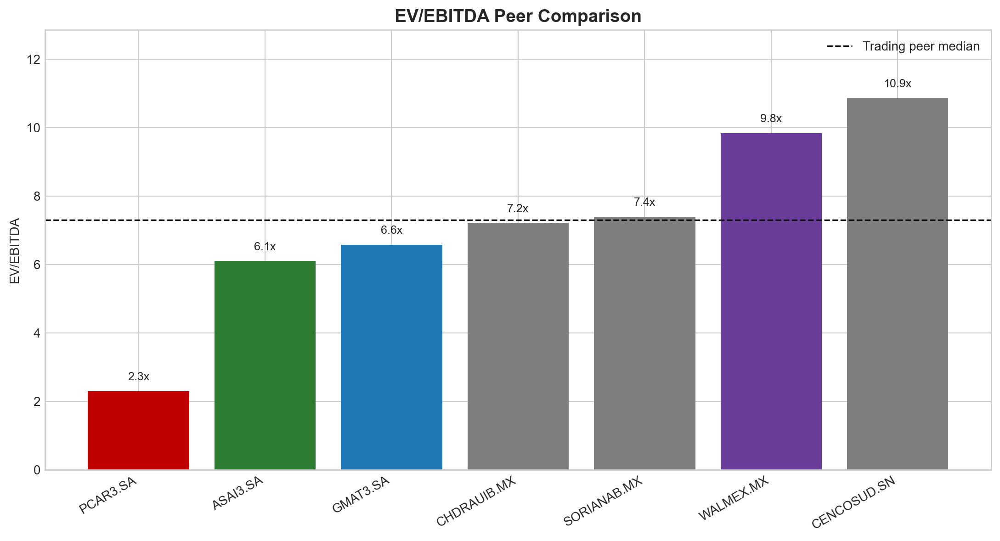
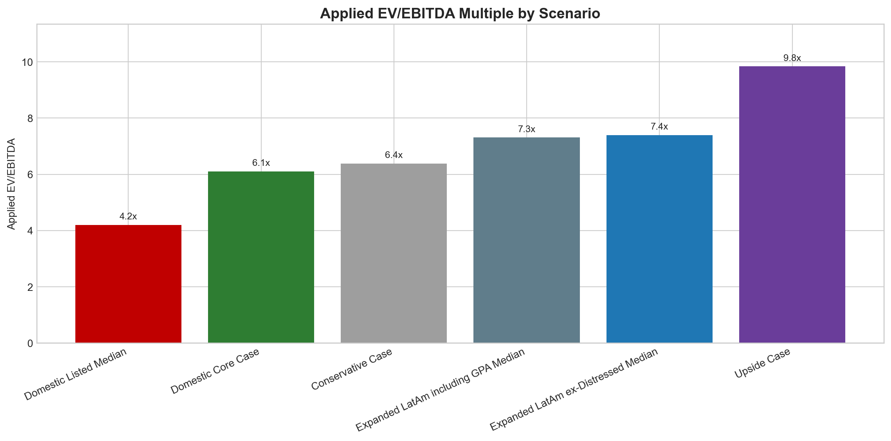
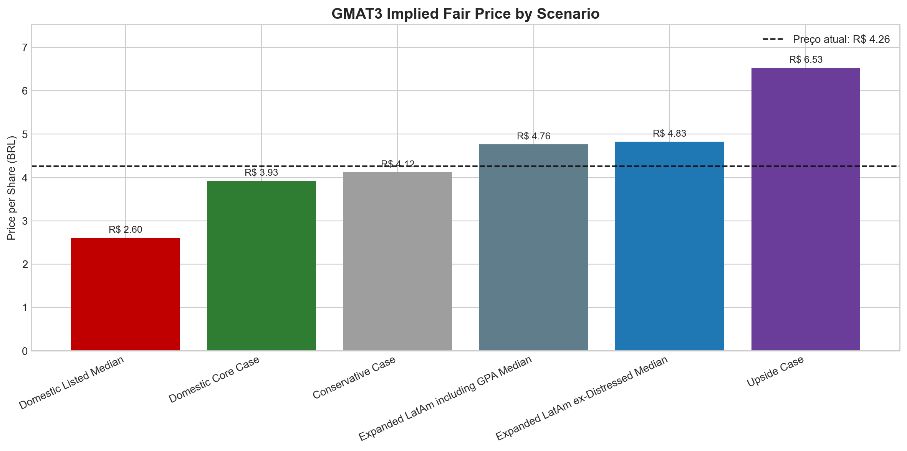
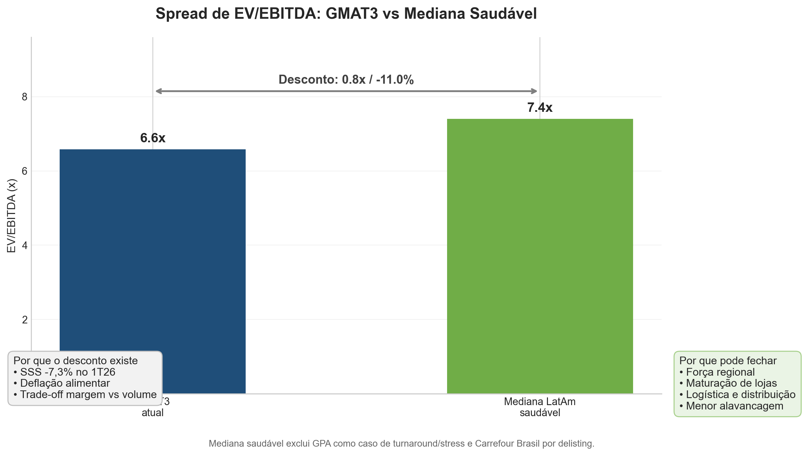
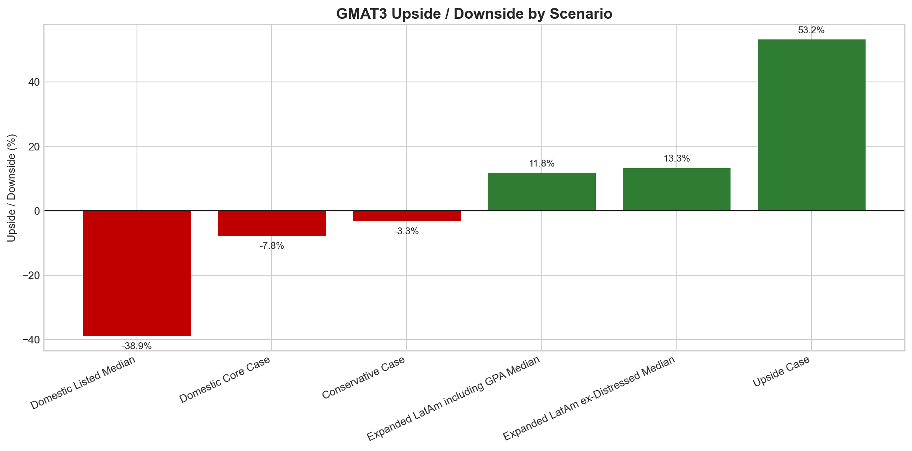
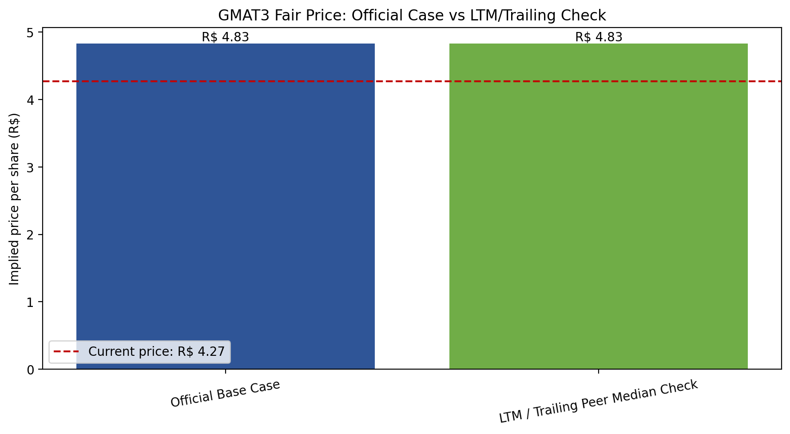

# Grupo Mateus (GMAT3) — Relative Valuation Report

**Setor:** Varejo alimentar / atacarejo  
**Empresa-alvo:** Grupo Mateus (`GMAT3.SA`)  
**Metodologia principal:** Valuation relativo por múltiplos  
**Múltiplo central:** EV/EBITDA  
**Data-base:** 31 de maio de 2026  
**Moeda:** BRL milhões, exceto preço por ação  

---

## 1. Sumário Executivo

O valuation relativo de Grupo Mateus sugere **upside moderado**, mas não caracteriza uma tese agressiva de compra. No caso base, aplicamos à GMAT3 a mediana de EV/EBITDA do peer group LatAm saudável, excluindo GPA como empresa em turnaround/distress e excluindo Carrefour Brasil como trading comp por conta do delisting de CRFB3.

O resultado do caso base é:

| Métrica | Resultado |
|---|---:|
| Preço atual | R$ 4,27 |
| Preço justo base | R$ 4,83 |
| Upside estimado | 13,0% |
| Múltiplo aplicado | 7,4x EV/EBITDA |
| EBITDA usado | R$ 1.600 mi |
| Dívida líquida | R$ 736 mi |

A tese central é construtiva, mas cautelosa:

> GMAT3 parece moderadamente descontada frente a pares LatAm comparáveis, mas o contexto operacional do 1T26 reduz a convicção da tese. O upside existe, porém depende de normalização de vendas mesmas lojas, recuperação de volume e manutenção da disciplina de margem.

Essa conclusão é importante porque evita uma leitura simplista do tipo “múltiplo baixo = compra”. O valuation mostra espaço de valorização, mas os fundamentos recentes indicam que esse desconto precisa ser interpretado com cuidado.

---

## 2. Resumo Setorial e Posicionamento da GMAT3

O setor de varejo alimentar no Brasil é estruturalmente defensivo, porque alimentos são bens de consumo recorrente. Mesmo em períodos de renda mais pressionada, o consumidor continua comprando alimentos, embora possa mudar a cesta, trocar marcas, reduzir itens discricionários ou buscar canais de preço mais competitivo.

Dentro desse mercado, o atacarejo ganhou relevância por combinar preço, escala, sortimento básico e eficiência operacional. O formato se beneficia principalmente em cenários de consumidor mais sensível a preço, inflação ou renda comprimida.

O Grupo Mateus se diferencia dos grandes players nacionais por ter uma presença regional muito forte, especialmente no Norte e Nordeste, além de operar formatos complementares de varejo, atacarejo e distribuição. Essa força regional é relevante porque a companhia conhece melhor seu mercado, tem capilaridade logística e pode capturar crescimento em regiões onde o varejo moderno ainda tem espaço de penetração.

Por outro lado, a concentração geográfica também aumenta o risco de execução. A tese depende de a companhia continuar expandindo sem perder eficiência, maturar lojas novas, preservar rentabilidade e defender participação de mercado em um ambiente competitivo.

---

## 3. O Que o 1T26 Mostrou

O 1T26 trouxe uma mensagem operacional mista para GMAT3. A receita ainda cresceu, mas a qualidade desse crescimento ficou menos clara por causa da pressão em vendas mesmas lojas e da queda de rentabilidade.

| Indicador 1T26 | Resultado | Leitura |
|---|---:|---|
| Crescimento da receita líquida | 12,9% | Crescimento ainda positivo |
| Lucro líquido | R$ 212,9 mi | Queda de 21,8% a/a |
| SSS | -7,3% | Pressão nas lojas maduras |
| Margem bruta | 22,9% | Preservação de margem funcionou |
| EBITDA pré-IFRS 16 | R$ 399,8 mi | Queda de 18,2% a/a |
| Margem EBITDA pré-IFRS 16 | 4,3% | Rentabilidade operacional pressionada |
| EBITDA pós-IFRS 16 | R$ 543,0 mi | Queda de 7,3% a/a |
| Margem EBITDA pós-IFRS 16 | 5,8% | Margem também em queda |

O ponto central é que GMAT3 conseguiu preservar margem bruta, mas ao custo de menor dinamismo em volume. A companhia enfrentou deflação alimentar, especialmente em commodities, consumidor mais endividado, mudança no perfil da cesta e desaceleração de vendas mesmas lojas. Isso gerou desalavancagem operacional: a empresa cresceu receita, mas não converteu esse crescimento em expansão proporcional de EBITDA e lucro.

Para o valuation, isso muda a leitura da tese. O desconto relativo não deve ser visto como uma oportunidade sem risco. Ele deve ser lido como uma combinação de:

- qualidade operacional e força regional;
- crescimento ainda positivo;
- mas com pressão de curto prazo em SSS, volume e lucro.

---

## 4. Peer Group e Segmentação

A escolha do peer group foi feita com base em proximidade operacional, disponibilidade de dados e comparabilidade de mercado. Como o universo brasileiro listado é pequeno, o grupo foi expandido para pares LatAm.

### 4.1 Segmentação dos Pares

| Empresa | Ticker | Segmento | Tratamento |
|---|---|---|---|
| Grupo Mateus | GMAT3.SA | Varejo alimentar regional / atacarejo | Empresa-alvo |
| Assaí | ASAI3.SA | Atacarejo Brasil | Peer doméstico core |
| GPA | PCAR3.SA | Varejo alimentar Brasil | Stress case / turnaround |
| Carrefour Brasil / Atacadão | CRFB3.SA | Atacarejo Brasil | Referência operacional, fora da mediana |
| Walmex | WALMEX.MX | Food retail / clubs México | Peer LatAm |
| Chedraui | CHDRAUIB.MX | Food retail México | Peer LatAm |
| Soriana | SORIANAB.MX | Food retail México | Peer LatAm |
| Cencosud | CENCOSUD.SN | Food retail / multi-formato Chile | Peer LatAm |

### 4.2 Por Que Cada Empresa Entrou

**Assaí** entrou como o comparável brasileiro mais limpo. É o peer doméstico mais próximo em atacarejo, tem capital aberto e múltiplo de mercado observável.

**GPA** entrou apenas como referência de stress. A empresa é relevante no varejo alimentar brasileiro, mas apresenta prejuízo, baixa comparabilidade de rentabilidade e perfil de turnaround. Por isso, GPA não deve ser usado como benchmark central de preço justo.

**Walmex, Chedraui, Soriana e Cencosud** entraram para ampliar a amostra de empresas listadas de varejo alimentar na América Latina. Esses pares ajudam a reduzir a dependência de apenas um peer brasileiro, mas trazem diferenças de país, moeda, escala e mix de formatos.

**Carrefour Brasil / Atacadão** é operacionalmente muito relevante, mas ficou fora da mediana principal porque CRFB3 foi deslistada. Sem ação listada, não há múltiplo de tela atual diretamente comparável para trading comps.

### 4.3 Por Que Não Usamos Peers dos EUA no Cálculo Principal

Empresas como Walmart, Costco, Kroger e BJ's foram avaliadas como referências amplas, mas ficaram fora da mediana principal. O motivo não é falta de qualidade; é excesso de diferença.

Essas empresas operam em mercado desenvolvido, com custo de capital, escala, estrutura competitiva, renda do consumidor e risco-país muito diferentes dos de GMAT3. Além disso, Costco e BJ's têm modelo de membership club, que gera economia e múltiplos estruturalmente diferentes do atacarejo brasileiro.

Usar esses nomes no cálculo principal poderia inflar artificialmente o múltiplo justo da GMAT3. Por isso, a decisão mais defensável foi manter EUA como referência qualitativa, não como benchmark quantitativo central.

---

## 5. Múltiplos Utilizados

### 5.1 EV/EBITDA

O múltiplo principal foi EV/EBITDA, porque ele compara o valor total da firma com sua geração operacional de resultado.

O Enterprise Value considera tanto o valor de mercado do equity quanto a dívida líquida:

> EV = Market Cap + Dívida Líquida

O EBITDA é usado como proxy operacional antes de juros, impostos, depreciação e amortização. Em varejo alimentar, EV/EBITDA é útil porque empresas podem ter estruturas de capital diferentes. Uma companhia mais alavancada pode parecer barata em P/L ou market cap, mas cara quando a dívida é considerada.

### 5.2 P/L

O P/L foi usado como múltiplo complementar:

> P/L = Valor de Mercado / Lucro Líquido

Ele mostra quanto o mercado paga por cada real de lucro líquido. Para GMAT3 e Assaí, o P/L é calculável. Para GPA, o P/L é **N.M.** porque a empresa teve prejuízo. Isso reforça que GPA não é benchmark central de valuation.

### 5.3 Lucro Líquido Setorial

Também calculamos o lucro líquido do recorte brasileiro:

| Recorte | Lucro líquido anualizado | Observação |
|---|---:|---|
| Brasil listado incluindo GMAT3, Assaí e GPA | -R$ 3.840 mi | GPA distorce o agregado |
| Pares brasileiros incluindo GPA | -R$ 4.692 mi | Resultado negativo por GPA |
| Pares brasileiros ex-GPA | R$ 696 mi | Apenas Assaí como peer saudável |

Esse exercício mostra por que P/L tem limitação forte neste projeto. Quando uma empresa relevante do grupo está em prejuízo, a média setorial de lucro perde utilidade econômica.

---

## 6. Leitura dos Múltiplos

O gráfico de EV/EBITDA mostra três blocos claros:

- GPA aparece com múltiplo muito baixo no caso anualizado, mas isso não representa necessariamente oportunidade. Reflete stress operacional, prejuízo e baixa qualidade de lucro.
- Assaí negocia próximo de GMAT3, o que sugere que GMAT3 não está absurdamente barata contra o peer doméstico mais direto.
- Os pares LatAm saudáveis negociam em faixa superior, especialmente Walmex e Cencosud, elevando a mediana expandida.

A mediana saudável ex-distressed usada no caso base foi de **7,4x EV/EBITDA**. Ela inclui:

- Assaí;
- Walmex;
- Chedraui;
- Soriana;
- Cencosud.

Essa mediana é mais equilibrada do que usar apenas Assaí, mas menos agressiva do que aplicar múltiplos premium de varejistas globais desenvolvidos.

---

## 7. Ajuste Qualitativo do Múltiplo

Não aplicamos a mediana de forma mecânica. O ponto de partida foi a mediana LatAm ex-distressed de **7,4x**, mas ela foi analisada à luz dos fundamentos de GMAT3.

| Etapa | Impacto | Múltiplo após etapa | Racional |
|---|---:|---:|---|
| Mediana LatAm ex-distressed | 7,4x | 7,4x | Peer set mais limpo |
| Prêmio operacional considerado | +0,2x | 7,6x | Força regional, maturação e logística |
| Desconto por cautela 1T26 | -0,2x | 7,4x | SSS negativo, deflação e menor dinamismo |
| Múltiplo final aplicado | 0,0x | 7,4x | Upside moderado, sem prêmio agressivo |

A leitura é: GMAT3 poderia justificar algum prêmio por qualidade regional, capilaridade logística e potencial de maturação. Porém, o 1T26 não permite aplicar esse prêmio com alta convicção. Assim, mantemos o múltiplo base em 7,4x.

Essa decisão é mais forte analiticamente do que simplesmente aplicar a mediana. Ela mostra que o múltiplo final não é uma conta automática, mas uma escolha fundamentada em qualidade operacional e risco.

---

## 8. Valuation por Cenários

| Cenário | Múltiplo | Preço justo | Upside / Downside | Leitura |
|---|---:|---:|---:|---|
| Conservative Case | 6,4x | R$ 4,12 | -3,3% | Stress se SSS e margem seguirem pressionados |
| Domestic Listed Median | 4,2x | R$ 2,60 | -38,9% | Mecânico demais, distorcido por GPA |
| Domestic Core Case | 6,1x | R$ 3,93 | -7,8% | Assaí-only, útil mas frágil por ser um peer só |
| Expanded LatAm ex-Distressed Median | 7,4x | R$ 4,83 | 13,3% | Caso base |
| Expanded LatAm including GPA Median | 7,3x | R$ 4,76 | 11,8% | Inclui GPA, ainda com upside |
| Upside Case | 9,8x | R$ 6,53 | 53,2% | Caso otimista, exige melhora operacional |

O caso base chega a **R$ 4,83 por ação**, contra preço atual de aproximadamente **R$ 4,27**. Isso implica upside de cerca de **13%**.

A conclusão não é que GMAT3 está muito barata. A conclusão é que ela parece **levemente descontada** quando comparada a um grupo saudável de varejistas LatAm, mas esse desconto precisa ser compensado por execução operacional.

---

## 9. Ponte de Valor

A ponte de valor segue a lógica clássica de EV para Equity Value:

> EBITDA anualizado × múltiplo aplicado = Enterprise Value implícito  
> Enterprise Value implícito - Dívida Líquida = Equity Value implícito  
> Equity Value implícito / Ações = Preço justo por ação

No caso base:

| Etapa | Valor |
|---|---:|
| EBITDA anualizado | R$ 1.600 mi |
| Múltiplo aplicado | 7,4x |
| Enterprise Value implícito | R$ 11.837 mi |
| Dívida líquida | R$ 736 mi |
| Equity Value implícito | R$ 11.101 mi |
| Ações | 2.300 mi |
| Preço justo | R$ 4,83 |

A dívida líquida de GMAT3 não destrói a tese. Pelo contrário, o perfil de alavancagem é mais leve que o de Assaí, o que reduz risco financeiro relativo. Ainda assim, o valuation depende mais da recuperação operacional do que da estrutura de capital.

---

## 10. Spread de Múltiplos

GMAT3 negocia em aproximadamente **6,6x EV/EBITDA** na base anualizada, enquanto a mediana saudável LatAm fica em **7,4x**. O spread é positivo para a tese: GMAT3 negocia abaixo da mediana saudável.

Mas esse desconto é parcialmente justificado. A companhia combina bons atributos estruturais com sinais recentes de pressão:

**Fatores que sustentam prêmio ou fechamento de desconto**

- força regional no Norte e Nordeste;
- potencial de maturação de lojas;
- rede logística e distribuição integrada;
- margem bruta resiliente;
- menor alavancagem que Assaí.

**Fatores que justificam cautela ou desconto**

- SSS negativo no 1T26;
- deflação alimentar reduzindo crescimento nominal;
- consumidor mais endividado;
- trade-off entre margem e volume;
- risco de competição no atacarejo;
- peer group pequeno e imperfeito.

Portanto, o spread parece existir, mas não deve ser interpretado como arbitragem óbvia. Ele é uma oportunidade condicionada à execução.

---

## 11. Check LTM vs 1T26 Anualizado

Um ponto metodológico importante foi testar se a aproximação `1T26 × 4` distorcia muito a conclusão.

O resultado do notebook de comparação LTM foi:

| Caso | Múltiplo | Preço justo | Upside |
|---|---:|---:|---:|
| Caso oficial | 7,398x | R$ 4,826 | 13,03% |
| Check LTM / trailing | 7,398x | R$ 4,826 | 13,03% |

Na execução atual, o teste LTM/trailing ficou praticamente igual ao caso oficial. Isso é um bom sinal metodológico: a conclusão base não depende de uma aproximação completamente fora da realidade.

Ainda assim, o ponto técnico permanece:

- `1T26 × 4` é uma aproximação simples;
- LTM é, em tese, mais robusto;
- como o 1T26 de GMAT3 foi pressionado, anualizar esse trimestre evita superestimar a companhia;
- para uma versão final institucional, o ideal seria usar EBITDA LTM auditável para todos os pares.

A mensagem para apresentação deve ser:

> A anualização do 1T26 é uma aproximação defensável para uma primeira leitura e, no nosso teste, não alterou materialmente a conclusão frente à leitura LTM/trailing disponível. Mesmo assim, mantemos a ressalva de que o LTM seria a base preferível em uma versão final mais robusta.

---

## 12. Tese Operacional

A tese de GMAT3 não deve ser defendida apenas por múltiplo. Ela precisa se apoiar em fundamentos operacionais do varejo.

### 12.1 Força Regional e Espaço de Penetração

GMAT3 tem posição forte em regiões onde ainda existe espaço para expansão do varejo moderno. A companhia conhece bem seus mercados, tem marca regional forte e pode capturar crescimento em cidades menos atendidas por grandes redes nacionais.

Essa característica ajuda a justificar por que GMAT3 não deveria negociar automaticamente com desconto profundo contra pares LatAm. Existe valor na especialização regional.

### 12.2 Maturação de Lojas

Parte relevante da tese depende da maturação de lojas abertas nos últimos ciclos de expansão. Em varejo, lojas novas normalmente levam tempo para atingir produtividade plena. Se a companhia conseguir amadurecer essas unidades sem deteriorar margem, pode recuperar alavancagem operacional.

Esse é um dos principais gatilhos para a tese: melhora de vendas por loja, diluição de custos fixos e recuperação de EBITDA.

### 12.3 Logística e Distribuição

No varejo alimentar, logística não é detalhe; é vantagem competitiva. Estoque, abastecimento, perdas, giro e disponibilidade de produto afetam diretamente margem e receita.

A estrutura de distribuição do Grupo Mateus sustenta sua força regional e ajuda a operar diferentes formatos. Isso é especialmente relevante em regiões de maior complexidade logística.

---

## 13. Principais Riscos

**SSS negativo persistente:** se vendas mesmas lojas continuarem fracas, a tese de maturação perde força.

**Deflação alimentar:** reduz crescimento nominal de receita e pode pressionar percepção de crescimento.

**Trade-off margem vs volume:** preservar margem sacrificando volume pode ser correto no curto prazo, mas limita crescimento se durar muito.

**Competição no atacarejo:** Assaí, Atacadão e players regionais seguem disputando preço, localização e fluxo.

**Peer group pequeno:** a amostra brasileira listada é limitada. A expansão LatAm melhora a base, mas reduz comparabilidade perfeita.

**Uso de 1T26 anualizado:** defensável como primeira aproximação, mas inferior a uma base LTM totalmente normalizada.

---

## 14. Conclusão de Equity Research

O valuation sugere que GMAT3 está moderadamente descontada frente a pares LatAm saudáveis. O caso base de **R$ 4,83 por ação** implica upside de aproximadamente **13%**, usando múltiplo de **7,4x EV/EBITDA**.

Nossa leitura, porém, não é de compra agressiva. O 1T26 trouxe sinais claros de cautela: SSS negativo, pressão de demanda, deflação alimentar e queda de lucro. Isso reduz a convicção da tese e impede aplicar um prêmio mais forte à companhia.

O trabalho conclui que:

- GMAT3 não parece cara frente ao peer group saudável;
- o desconto relativo existe, mas é moderado;
- GPA deve ser tratado como stress case, não benchmark central;
- Assaí é o peer doméstico mais limpo, mas sozinho é insuficiente;
- o peer set LatAm ex-distressed é a melhor referência disponível;
- a tese depende de recuperação operacional, especialmente SSS e volume;
- o método `1T26 × 4` é aceitável como aproximação conservadora, mas LTM auditável seria o próximo avanço metodológico.

**Conclusão final:**

> GMAT3 apresenta upside moderado frente ao peer group LatAm ex-distressed, mas o potencial de valorização deve ser interpretado com cautela diante dos sinais de pressão operacional no 1T26. A tese é construtiva, porém condicionada à normalização de vendas mesmas lojas, recuperação de volume e manutenção da disciplina de margem.

---

## 15. Como Defender no Slide Final

### Os Números

Preço atual de aproximadamente **R$ 4,27** contra preço justo base de **R$ 4,83**, implicando upside de **13%**. O caso base usa **7,4x EV/EBITDA**, mediana de pares LatAm saudáveis ex-GPA.

### O Spread

GMAT3 negocia abaixo da mediana saudável LatAm. O desconto é parcialmente justificado pelo 1T26 pressionado, mas pode fechar se a companhia recuperar SSS e alavancagem operacional.

### A Tese

1. Força regional e exposição a mercados com espaço de penetração do varejo moderno.  
2. Maturação de lojas como gatilho de recuperação de produtividade.  
3. Logística e distribuição como vantagem operacional em regiões complexas.

### Riscos

SSS negativo, deflação alimentar, consumidor pressionado, competição no atacarejo e limitação do peer group.

---

## 16. Arquivos de Suporte

| Tipo | Arquivo |
|---|---|
| Notebook de validação | `notebooks/01-data-validation.ipynb` |
| Notebook de valuation | `notebooks/02-relative-valuation.ipynb` |
| Notebook de gráficos | `notebooks/03-valuation-charts.ipynb` |
| Notebook LTM check | `notebooks/04-ltm-comparison.ipynb` |
| Base processada | `data/processed/master_valuation_dataset.csv` |
| Base normalizada | `data/processed/normalized_valuation_base.csv` |
| Cenários de valuation | `outputs/gmat3_relative_valuation_scenarios.csv` |
| Check LTM | `outputs/ltm_methodology_valuation_check.csv` |
| Workbook Excel | `outputs/gmat3_valuation_research_workbook.xlsx` |
